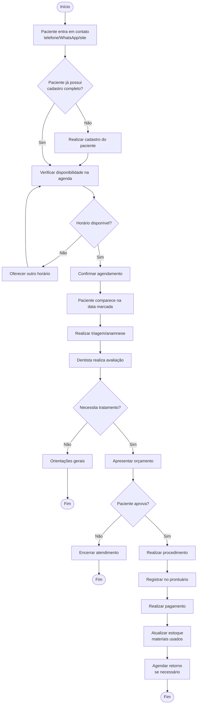
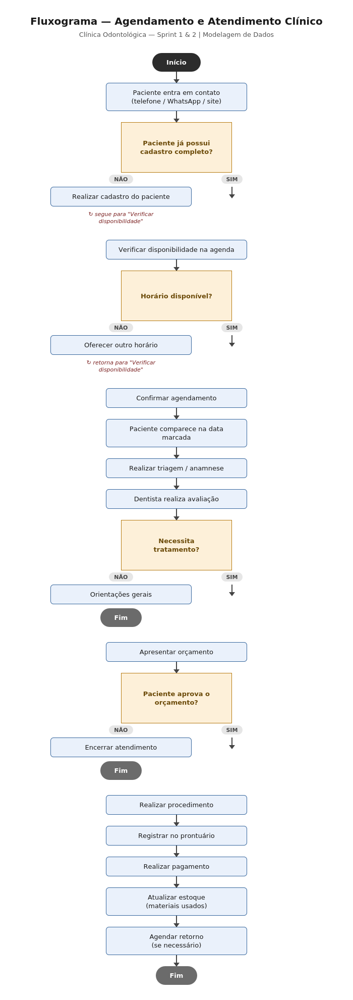
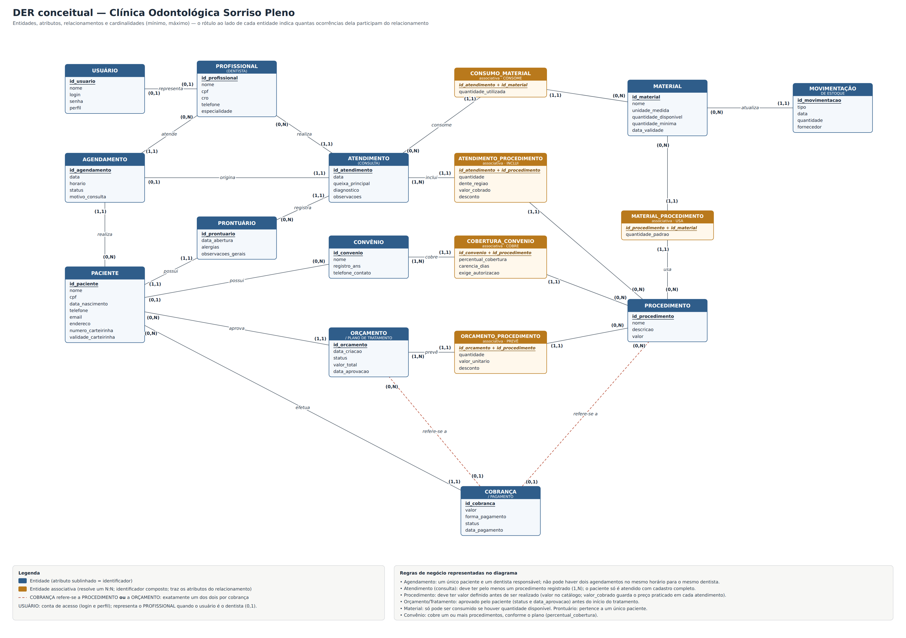

# Projeto ERP — Clínica Odontológica Sorriso Pleno*

> *Clínica Odontológica Sorriso Pleno

## 1. Identificação da equipe
- Dentista
- Auxiliar de limpeza
- Recepcionista

## 2. Caracterização da empresa

A Clínica Odontológica Sorriso Pleno é uma microempresa do setor de saúde odontológica, que presta atendimento clínico a pacientes particulares e conveniados. A clínica funciona com um único dentista responsável, atendendo em um consultório próprio, com apoio de uma recepcionista, auxiliar de limpeza e auxiliar de saúde bucal.

**Segmento:** Saúde — odontologia (clínica de pequeno porte).

**O que oferece:** consultas odontológicas, procedimentos de rotina (limpeza, restauração, extração), avaliações e orçamentos de tratamento, além de tratamentos especializados (ex.: canal, próteses, implantes, aparelho).

**Principais clientes:**
- Pacientes particulares, que pagam diretamente pelos procedimentos;
- Pacientes conveniados, atendidos através de convênios odontológicos, nos quais somente alguns procedimentos são cobertos pelo plano.

**Principais setores/áreas da clínica:**
- Recepção/Administrativo — agendamento de consultas, cadastro de pacientes, controle financeiro;
- Atendimento clínico — consultas, procedimentos, prontuário do paciente;
- Estoque — controle de materiais e insumos odontológicos (luvas, anestésicos, resinas, etc.), usados nos atendimentos;
- Financeiro — controle de pagamentos particulares, faturamento de convênios, controle de despesas com materiais.

**Como funciona atualmente:** o agendamento de consultas e o cadastro de pacientes são feitos em uma agenda física e em planilhas soltas, sem integração entre si. O controle de estoque de materiais é feito de forma manual, sem relação direta com os procedimentos realizados, o que dificulta saber quanto material foi consumido por atendimento. O controle financeiro mistura recebimentos particulares e valores de convênio na mesma planilha, sem distinção clara entre o que já foi recebido e o que ainda está pendente de repasse pelo convênio.

**Informações importantes para o negócio:**
- Dados cadastrais e histórico clínico de cada paciente (procedimentos realizados, datas, observações);
- Informações sobre os convênios aceitos e as regras de cobertura de cada um;
- Controle de estoque dos materiais utilizados em cada procedimento;
- Controle financeiro (o que foi pago pelo paciente, o que será reembolsado/faturado pelo convênio);
- Agenda de horários do dentista, evitando conflitos de atendimento.

## 3. Justificativa da escolha

A Clínica Odontológica foi escolhida como contexto do projeto porque reúne, em uma estrutura relativamente simples, processos suficientemente ricos para serem modelados: agendamento, atendimento clínico, controle de estoque e controle financeiro com duas formas de pagamento distintas (particular e convênio).

Essa combinação gera problemas reais de organização das informações: como os controles hoje são feitos em planilhas e registros manuais separados, não há integração entre agenda, prontuário, estoque e financeiro. Isso torna a clínica candidata natural a um sistema ERP, pois a integração desses módulos resolveria diretamente os principais problemas identificados (retrabalho, falta de rastreabilidade de materiais e dificuldade de conciliar recebimentos particulares e de convênio).

Além disso, o negócio possui uma complexidade de relacionamento interessante para a modelagem de dados — por exemplo, um mesmo procedimento pode consumir vários materiais de estoque, um paciente pode ter vários procedimentos ao longo do tempo, e o convênio impõe regras específicas de cobertura — o que justifica plenamente a aplicação de um projeto de modelagem de dados completo.

## 4. Problemas identificados

| Problema | Consequência |
|---|---|
| Agendamento feito em agenda física/caderno | Risco de conflito de horários (dois pacientes marcados no mesmo horário) e dificuldade de reagendar |
| Cadastro de pacientes em planilhas soltas, sem padrão | Duplicidade de cadastro do mesmo paciente e dados desatualizados (telefone, endereço) |
| Histórico clínico/prontuário anotado em papel avulso | Informações perdidas ou de difícil acesso em atendimentos futuros |
| Controle de estoque de materiais feito manualmente, sem vínculo com os atendimentos | Falta de rastreabilidade: não se sabe quanto material foi consumido em cada procedimento, gerando erros na quantidade disponível e risco de faltar insumo |
| Recebimentos particulares e valores de convênio lançados na mesma planilha, sem distinção | Dificuldade para saber o que já foi efetivamente recebido e o que ainda está pendente de repasse do convênio |
| Regras de cobertura de cada convênio guardadas informalmente (memória do dentista/recepção) | Erros ao informar ao paciente o que é coberto ou não, retrabalho para confirmar com o convênio |
| Ausência de relatórios consolidados (financeiro, estoque, atendimentos) | Dificuldade da clínica em acompanhar resultados, tomar decisões e planejar compras de material |

**Principais necessidades identificadas:**
- Centralizar o cadastro de pacientes e evitar duplicidade;
- Vincular o consumo de materiais de estoque a cada procedimento realizado;
- Separar claramente, no financeiro, valores particulares e valores de convênio, com status de pagamento/recebimento;
- Registrar as regras de cobertura de cada convênio de forma estruturada;
- Ter uma agenda única, evitando conflitos de horário do dentista;
- Gerar relatórios simples de estoque, financeiro e atendimentos.

## 5. Processos de negócio

**Visão geral — Clínica odontológica:**

`Cliente → Agenda serviço → Paciente → Atendimento/Procedimento → Pagamento → Retorno/Acompanhamento`

**Fluxo de estoque:** `Necessidade de material → Verificação de estoque → Pedido ao fornecedor → Recebimento → Armazenagem → Consumo no atendimento`

### 5.1 Captação e Agendamento
- **Quem participa?** Recepcionista/atendente e paciente (ou responsável)
- **O que inicia o processo?** Paciente entra em contato (WhatsApp, telefone, site, indicação)
- **O que acontece?** Atendente coleta nome, telefone, motivo da consulta; verifica horários disponíveis na agenda; marca o horário; envia confirmação
- **Qual informação é gerada?** Cadastro inicial do paciente, data/hora agendada, motivo da consulta
- **Qual é o resultado?** Consulta agendada e confirmada

### 5.2 Recepção e Triagem
- **Quem participa?** Recepcionista e paciente
- **O que inicia o processo?** Chegada do paciente na clínica no dia da consulta
- **O que acontece?** Confirmação de identidade, atualização de cadastro (endereço, convênio, histórico de saúde), preenchimento/atualização da anamnese, encaminhamento à sala de espera
- **Qual informação é gerada?** Ficha cadastral atualizada, anamnese (alergias, medicamentos, condições de saúde)
- **Qual é o resultado?** Paciente pronto para ser chamado pelo dentista

### 5.3 Atendimento Clínico
- **Quem participa?** Dentista, auxiliar/ASB, paciente
- **O que inicia o processo?** Chamada do paciente para o consultório
- **O que acontece?** Avaliação clínica, exame (visual, radiográfico se necessário), diagnóstico, definição do plano de tratamento, execução do procedimento (se for o dia do procedimento) ou apresentação do orçamento
- **Qual informação é gerada?** Diagnóstico, plano de tratamento, prontuário/evolução clínica, orçamento
- **Qual é o resultado?** Procedimento realizado ou tratamento planejado e orçado

### 5.4 Financeiro
- **Quem participa?** Recepcionista/financeiro e paciente
- **O que inicia o processo?** Orçamento aprovado pelo paciente ou procedimento concluído
- **O que acontece?** Definição da forma de pagamento (à vista, convênio, parcelado), cobrança, emissão de nota fiscal/recibo, registro no sistema financeiro
- **Qual informação é gerada?** Comprovante de pagamento, nota fiscal, status financeiro do paciente
- **Qual é o resultado?** Pagamento recebido e registrado

### 5.5 Pós-atendimento e Retorno
- **Quem participa?** Dentista, recepcionista, paciente
- **O que inicia o processo?** Fim do atendimento/procedimento
- **O que acontece?** Orientações pós-procedimento, agendamento de retorno (se necessário), ligação/mensagem de acompanhamento, inclusão em programa de manutenção preventiva (limpeza semestral, por exemplo)
- **Qual informação é gerada?** Data do próximo retorno, observações de acompanhamento
- **Qual é o resultado?** Paciente fidelizado com retorno agendado

### 5.6 Fluxo de estoque/material
- **Quem participa?** Auxiliar/ASB, dentista, responsável por compras
- **O que inicia o processo?** Uso de insumos durante o atendimento (resina, anestesia, luvas, sugadores, etc.)
- **O que acontece?** Baixa no estoque, verificação de níveis mínimos, pedido de reposição junto a fornecedores
- **Qual informação é gerada?** Controle de estoque, histórico de consumo, pedidos de compra
- **Qual é o resultado?** Estoque reposto e disponível para os próximos atendimentos

## 6. Requisitos funcionais

**Pergunta: "O que o sistema deve fazer?"**

**Cadastros**
- O sistema deverá cadastrar pacientes.
- O sistema deverá cadastrar dentistas e profissionais da clínica.
- O sistema deverá cadastrar convênios/planos odontológicos.
- O sistema deverá cadastrar procedimentos e serviços oferecidos (com valores).
- O sistema deverá cadastrar materiais e insumos utilizados nos procedimentos.

**Agendamento**
- O sistema deverá permitir o agendamento de consultas.
- O sistema deverá permitir a confirmação e o cancelamento de agendamentos.
- O sistema deverá exibir a agenda dos dentistas por dia/semana/mês.

**Atendimento Clínico**
- O sistema deverá registrar a queixa principal do paciente.
- O sistema deverá registrar o diagnóstico e o plano de tratamento.
- O sistema deverá manter o prontuário/histórico clínico de cada paciente.
- O sistema deverá permitir anexar exames e radiografias ao prontuário.

**Financeiro**
- O sistema deverá gerar orçamentos de tratamento.
- O sistema deverá registrar pagamentos (à vista, parcelado, convênio).
- O sistema deverá emitir recibos e notas fiscais.
- O sistema deverá controlar contas a receber e inadimplência.

**Estoque**
- O sistema deverá controlar o estoque de materiais odontológicos.
- O sistema deverá dar baixa automática no estoque ao registrar um procedimento.
- O sistema deverá alertar quando o estoque estiver abaixo do nível mínimo.

**Relacionamento e Retorno**
- O sistema deverá permitir consultar o histórico de atendimentos do paciente.
- O sistema deverá agendar retornos e consultas de manutenção preventiva.
- O sistema deverá enviar lembretes de consulta (e-mail/SMS/WhatsApp).

**Relatórios**
- O sistema deverá gerar relatórios de faturamento.
- O sistema deverá gerar relatórios de procedimentos mais realizados.
- O sistema deverá gerar relatórios de desempenho por dentista.

## 7. Requisitos não funcionais

- O sistema deverá ser fácil de usar, mesmo para pessoas com pouca experiência com computador.
- O sistema deverá exigir login e senha para acessar as informações.
- O sistema deverá ser rápido ao abrir as telas e realizar as buscas.
- O sistema deverá funcionar corretamente nos principais navegadores (Google Chrome, por exemplo).
- O sistema deverá manter os dados dos pacientes salvos com segurança, sem risco de perda.
- O sistema deverá estar disponível para uso durante o horário de funcionamento da clínica.
- O sistema deverá ter uma interface organizada e de fácil entendimento.
- O sistema deverá permitir que apenas pessoas autorizadas vejam informações mais sensíveis, como o prontuário do paciente.
- O sistema deverá fazer backup (cópia de segurança) dos dados de tempos em tempos, para evitar perda de informações.
- O sistema deverá exibir mensagens claras quando o usuário cometer algum erro, como preencher um campo de forma errada.
- O sistema deverá funcionar bem mesmo com vários usuários (recepcionista, dentista, financeiro) usando ao mesmo tempo.
- O sistema deverá poder ser usado tanto em computador quanto em tablet, já que a recepção pode usar dispositivos diferentes.

## 8. Regras de negócio

- Um paciente pode realizar vários agendamentos.
- Um agendamento deve estar associado a apenas um paciente.
- Um agendamento deve estar associado a um dentista responsável.
- Uma consulta deve possuir pelo menos um procedimento registrado.
- Um dentista pode atender vários pacientes.
- Um paciente pode ter vários procedimentos ao longo do tempo.
- Um procedimento deve ter um valor definido antes de ser realizado.
- Um orçamento deve ser aprovado pelo paciente antes do início do tratamento.
- Um pagamento deve estar associado a um paciente e a um procedimento (ou tratamento).
- Um paciente não pode ser atendido sem antes ter um cadastro completo na clínica.
- Um material do estoque só pode ser utilizado se houver quantidade disponível.
- Um convênio pode cobrir um ou mais procedimentos, conforme o plano contratado.
- Um agendamento não pode ser marcado em um horário já ocupado pelo mesmo dentista.
- Um prontuário pertence a um único paciente.

## 9. Restrições e políticas organizacionais

**Quem pode aprovar uma operação**
- Somente o dentista responsável pode aprovar um plano de tratamento.
- Somente o administrador/gerente pode aprovar descontos acima de um determinado valor.

**Quem pode alterar determinado cadastro**
- Apenas a recepção pode alterar dados cadastrais dos pacientes (endereço, telefone, convênio).
- Apenas o dentista responsável pode alterar informações do prontuário e do plano de tratamento.
- Apenas o administrador pode alterar o cadastro de profissionais e permissões de acesso.

**Limites de desconto**
- A recepção pode conceder desconto de até 10% sem autorização caso seja no pix ou em dinheiro.
- Descontos acima de 10% precisam de aprovação do administrador da clínica.
- Descontos em pagamentos no cartão ou parcelados precisam de aprovação do administrador da clínica.

**Condições de pagamento**
- Tratamentos podem ser parcelados em até um determinado número de vezes, conforme política da clínica.
- Pagamentos via convênio dependem da confirmação de cobertura antes do início do procedimento.

**Regras de cancelamento**
- O paciente deve avisar o cancelamento com pelo menos 24 horas de antecedência.
- Cancelamentos fora do prazo podem gerar cobrança de uma taxa, conforme política da clínica.

**Políticas de estoque**
- Materiais próximos da validade devem ser utilizados primeiro (ordem de vencimento).
- A compra de novos materiais só pode ser autorizada pelo responsável pelo setor de compras/estoque.

**Regras de acesso às informações**
- Apenas dentistas e administradores podem visualizar o prontuário completo do paciente.
- A recepção tem acesso apenas aos dados cadastrais e financeiros, sem acesso ao histórico clínico detalhado.
- Informações do paciente não podem ser compartilhadas com terceiros sem autorização, conforme a LGPD.

## 10. Fluxogramas

### Fluxo: Agendamento e atendimento clínico

Versão em imagem do mesmo fluxograma:

[Fluxograma em PDF](docs/fluxograma-agendamento-atendimento.pdf)

**Coerência com as etapas anteriores:** este fluxo reflete diretamente os processos "Captação e Agendamento" (5.1), "Recepção e Triagem" (5.2) e "Atendimento Clínico" (5.3), e as regras de negócio sobre agendamento vinculado a um paciente e a um dentista, sobre a exigência de cadastro completo antes do atendimento, sobre a consulta possuir ao menos um procedimento registrado e sobre o orçamento precisar ser aprovado antes do início do tratamento.

## 11. Entidades

> As entidades abaixo foram extraídas dos processos, requisitos e regras de negócio já documentados (seções 5 a 8).

| Entidade | De onde veio | Por que existe |
|---|---|---|
| **Paciente** | Processo 5.1 (Captação e Agendamento); requisitos de cadastro de pacientes | É quem recebe o atendimento; precisa ser identificado unicamente para evitar cadastro duplicado (problema identificado na seção 4) |
| **Convênio** | Processo 5.2; requisito "cadastrar convênios/planos odontológicos"; regra "convênio pode cobrir um ou mais procedimentos" | Tem regras de cobertura próprias, que não pertencem nem ao paciente nem ao procedimento isoladamente |
| **Profissional (Dentista)** | Processos 5.1, 5.3; requisito "cadastrar dentistas e profissionais"; regras sobre agendamento associado a um dentista responsável e sem choque de horário | O agendamento exige um dentista responsável e o sistema precisa impedir choque de horário *para o mesmo dentista* — isso só é possível se o dentista for uma entidade identificável |
| **Usuário** | Requisitos não funcionais (login e senha, acesso por perfil, múltiplos usuários simultâneos) | Controle de acesso por perfil (dentista, recepcionista, auxiliar), distinto do cadastro de Paciente ou Profissional |
| **Agendamento** | Processo 5.1; requisitos de agendamento; regras sobre paciente/dentista/horário do agendamento | Representa a marcação da consulta, podendo não se concretizar (falta/cancelamento) |
| **Atendimento (Consulta)** | Processos 5.2, 5.3; requisito de registrar queixa/diagnóstico/plano de tratamento; regra "consulta deve possuir pelo menos um procedimento registrado" | Representa o que de fato aconteceu — exige que toda consulta tenha ao menos um procedimento registrado, o que só faz sentido se Atendimento for uma entidade que agrupa procedimentos realizados |
| **Procedimento** | Processo 5.3; requisito "cadastrar procedimentos e serviços oferecidos (com valores)"; regra "procedimento deve ter valor definido antes de ser realizado" | Catálogo de procedimentos oferecidos; precisa ter um valor definido *antes* de ser realizado — por isso o valor é atributo do Procedimento (catálogo), não do atendimento |
| **Orçamento/Plano de Tratamento** | Processo 5.3 ("apresentação do orçamento"); regra "orçamento deve ser aprovado pelo paciente antes do início do tratamento" | Introduz uma etapa própria no modelo: antes de iniciar um tratamento, deve existir um orçamento com status de aprovação pelo paciente. Sem essa entidade, não haveria como registrar "o que foi orçado" separado de "o que já foi de fato realizado". Orçamento e Tratamento foram unificados em uma única entidade (com atributo de status: pendente/aprovado/em andamento/concluído), decisão confirmada com o grupo/professor, já que o tratamento nasce do próprio orçamento aprovado |
| **Prontuário** | Regra "um prontuário pertence a um único paciente"; requisito "manter o prontuário/histórico clínico de cada paciente" | Trata o prontuário como algo com identidade própria: é o "cabeçalho" único do histórico clínico do paciente (aberto no cadastro), e cada Atendimento é um registro vinculado a esse prontuário |
| **Material** | Processo 5.6 (Fluxo de estoque/material); requisito "cadastrar materiais e insumos"; regra "material só pode ser utilizado se houver quantidade disponível" | Item de estoque consumido nos atendimentos; a regra exige checar quantidade disponível antes do uso |
| **Movimentação de Estoque** | Processo 5.6 ("pedido de reposição junto a fornecedores") | Registra entradas de material (compras), permitindo rastrear o histórico de reposição |
| **Cobrança/Pagamento** | Processo 5.4 (Financeiro); requisitos financeiros; regra "pagamento deve estar associado a um paciente e a um procedimento (ou tratamento)" | A regra de negócio exige que o pagamento esteja associado a um paciente **e** a um procedimento (ou ao tratamento inteiro), confirmando que a cobrança não pode ser apenas um campo solto no Atendimento |

**Entidades associativas** (criadas na resolução dos relacionamentos N:N, seções 14 e 15 do trabalho):

| Entidade associativa | Liga | Origem |
|---|---|---|
| ATENDIMENTO_PROCEDIMENTO | Atendimento e Procedimento | regra "consulta deve possuir pelo menos um procedimento registrado" |
| ORCAMENTO_PROCEDIMENTO | Orçamento e Procedimento | processo 5.3 (apresentação do orçamento) |
| COBERTURA_CONVENIO | Convênio e Procedimento | regra "convênio pode cobrir um ou mais procedimentos" |
| CONSUMO_MATERIAL | Atendimento e Material | processo 5.6 (baixa no estoque) |
| MATERIAL_PROCEDIMENTO | Procedimento e Material | requisito "dar baixa automática no estoque ao registrar um procedimento" |

Com elas, o modelo passa a ter **17 entidades** (12 do negócio e 5 associativas).

**Decisões confirmadas com o grupo/professor:**
- ✅ **Orçamento e Tratamento unificados** em uma única entidade, com atributo de status (pendente/aprovado/em andamento/concluído).
- ✅ **Cobrança/Pagamento pode se relacionar tanto com um Procedimento avulso quanto com um Orçamento/Tratamento inteiro** — pode existir cobrança de um procedimento isolado (ex.: uma limpeza avulsa) e cobrança vinculada a um tratamento em andamento (ex.: parcelas de um tratamento ortodôntico).

**Ponto em aberto para a Etapa de Relacionamentos:**
- Como Cobrança pode se referir a Procedimento OU a Orçamento/Tratamento (nunca aos dois ao mesmo tempo), isso vai exigir dois relacionamentos opcionais (Cobrança–Procedimento e Cobrança–Tratamento), com a regra de que exatamente um dos dois deve estar preenchido em cada cobrança.
- A regra "convênio pode cobrir um ou mais procedimentos" sugere uma entidade associativa entre Convênio e Procedimento — a detalhar na Etapa 15 (Dicionário de dados/atributos de relacionamento).

**Entidades descartadas (e por quê):**
- *Auxiliar de limpeza* como entidade separada — não participa diretamente de processos clínicos, financeiros ou de estoque que exijam registro individual no sistema; se precisar de login, entra como Usuário.
- *Consultório/Sala* — a clínica tem apenas um consultório, sem necessidade de rastrear por sala.

## 12. Atributos

**PACIENTE**
- id_paciente
- nome
- cpf
- data_nascimento
- telefone
- email
- endereco
- numero_carteirinha *(somente para pacientes conveniados)*
- validade_carteirinha *(somente para pacientes conveniados)*

**CONVÊNIO**
- id_convenio
- nome
- registro_ans
- telefone_contato

**PROFISSIONAL (DENTISTA)**
- id_profissional
- nome
- cpf
- cro
- telefone
- especialidade

**USUÁRIO**
- id_usuario
- nome
- login
- senha
- perfil

**AGENDAMENTO**
- id_agendamento
- data
- horario
- status
- motivo_consulta

**ATENDIMENTO (CONSULTA)**
- id_atendimento
- data
- queixa_principal
- diagnostico
- observacoes

**PROCEDIMENTO**
- id_procedimento
- nome
- descricao
- valor

**ORÇAMENTO/PLANO DE TRATAMENTO**
- id_orcamento
- data_criacao
- status
- valor_total
- data_aprovacao

**PRONTUÁRIO**
- id_prontuario
- data_abertura
- alergias
- observacoes_gerais

**MATERIAL**
- id_material
- nome
- unidade_medida
- quantidade_disponivel
- quantidade_minima
- data_validade

**MOVIMENTAÇÃO DE ESTOQUE**
- id_movimentacao
- tipo
- data
- quantidade
- fornecedor

**COBRANÇA/PAGAMENTO**
- id_cobranca
- valor
- forma_pagamento
- status
- data_pagamento

**Pontos de atenção para a Etapa de Relacionamentos:**
- O atributo *status* aparece em Agendamento, Orçamento e Cobrança com domínios de valores diferentes (confirmado/cancelado/realizado; pendente/aprovado/em andamento/concluído; pago/pendente/faturado ao convênio) — detalhar no dicionário de dados.
- Atendimento e Procedimento são entidades separadas (execução x catálogo); será necessário um relacionamento/entidade associativa entre elas para registrar quais procedimentos foram realizados em cada atendimento.

## 13. Relacionamentos

1. **PACIENTE — POSSUI — CONVÊNIO** *(convênio é opcional — paciente pode ser particular)*
2. **PACIENTE — REALIZA — AGENDAMENTO** *("um paciente pode realizar vários agendamentos")*
3. **PROFISSIONAL — ATENDE — AGENDAMENTO** *("agendamento deve estar associado a um dentista responsável")*
4. **AGENDAMENTO — ORIGINA — ATENDIMENTO** *(quando o paciente comparece na data marcada, o agendamento dá origem ao atendimento)*
5. **PACIENTE — POSSUI — PRONTUÁRIO** *("um prontuário pertence a um único paciente")*
6. **PRONTUÁRIO — REGISTRA — ATENDIMENTO** *(cada atendimento fica registrado no prontuário do paciente)*
7. **PROFISSIONAL — REALIZA — ATENDIMENTO** *(processo 5.3: dentista realiza a avaliação/procedimento)*
8. **ATENDIMENTO — INCLUI — PROCEDIMENTO** ⚠️N:N *("uma consulta deve possuir pelo menos um procedimento registrado")*
9. **PACIENTE — APROVA — ORÇAMENTO** *("orçamento deve ser aprovado pelo paciente antes do início do tratamento")*
10. **ORÇAMENTO — PREVÊ — PROCEDIMENTO** ⚠️N:N *(o orçamento lista os procedimentos previstos no tratamento)*
11. **CONVÊNIO — COBRE — PROCEDIMENTO** ⚠️N:N *("convênio pode cobrir um ou mais procedimentos, conforme o plano")*
12. **PACIENTE — EFETUA — COBRANÇA** *(processo 5.4 Financeiro: cobrança e registro do pagamento)*
13. **COBRANÇA — REFERE-SE A — PROCEDIMENTO** *(ou)* **COBRANÇA — REFERE-SE A — ORÇAMENTO** *("pagamento deve estar associado a um paciente e a um procedimento (ou tratamento)" — relação opcional para um dos dois lados)*
14. **ATENDIMENTO — CONSOME — MATERIAL** ⚠️N:N *(processo 5.6: uso de insumos durante o atendimento)*
15. **MOVIMENTAÇÃO DE ESTOQUE — ATUALIZA — MATERIAL** *(processo 5.6: entrada de materiais no estoque)*
16. **PROCEDIMENTO — USA — MATERIAL** ⚠️N:N *(requisito "dar baixa automática no estoque ao registrar um procedimento": cada procedimento tem uma lista padrão de materiais)*
17. **USUÁRIO — REPRESENTA — PROFISSIONAL** *(requisitos não funcionais: login e acesso por perfil; quando o usuário é o dentista, a conta de acesso representa o profissional)*

> ⚠️N:N (8, 10, 11, 14 e 16) = relacionamento que deve gerar uma entidade associativa com atributos próprios (ex.: ATENDIMENTO–PROCEDIMENTO pode ter "valor_cobrado_no_atendimento"; CONVÊNIO–PROCEDIMENTO pode ter "percentual_cobertura") — a detalhar na Etapa 15 (Dicionário de dados).

## 14. Cardinalidades

> Notação (mínimo, máximo), seguindo o método "vá e volte" do manual: o número ao lado de cada entidade responde "quantos do outro lado ela pode ter".

**1. PACIENTE (0,1) — POSSUI — CONVÊNIO (0,N)**
- Um paciente possui quantos convênios? **0,1**: pode ser particular (nenhum) ou ter um convênio.
- Um convênio pertence a quantos pacientes? **0,N**: pode estar cadastrado sem pacientes ou atender vários.

**2. PACIENTE (0,N) — REALIZA — AGENDAMENTO (1,1)**
- Um paciente realiza quantos agendamentos? **0,N**: pode estar cadastrado e ainda não ter agendado, ou ter vários.
- Um agendamento pertence a quantos pacientes? **1,1**: regra "agendamento deve estar associado a apenas um paciente".

**3. PROFISSIONAL (0,N) — ATENDE — AGENDAMENTO (1,1)**
- Um dentista atende quantos agendamentos? **0,N**
- Um agendamento tem quantos dentistas? **1,1**: regra "agendamento deve estar associado a um dentista responsável".

**4. AGENDAMENTO (0,1) — ORIGINA — ATENDIMENTO (1,1)**
- Um agendamento origina quantos atendimentos? **0,1**: pode não virar atendimento (falta ou cancelamento).
- Um atendimento vem de quantos agendamentos? **1,1**: pelo fluxograma, todo atendimento começa com um agendamento.

**5. PACIENTE (1,1) — POSSUI — PRONTUÁRIO (1,1)**
- Um paciente possui quantos prontuários? **1,1**: o prontuário é aberto no cadastro.
- Um prontuário pertence a quantos pacientes? **1,1**: regra "prontuário pertence a um único paciente".

**6. PRONTUÁRIO (0,N) — REGISTRA — ATENDIMENTO (1,1)**
- Um prontuário registra quantos atendimentos? **0,N**: fica vazio até o primeiro atendimento.
- Um atendimento fica em quantos prontuários? **1,1**

**7. PROFISSIONAL (0,N) — REALIZA — ATENDIMENTO (1,1)**
- Um dentista realiza quantos atendimentos? **0,N**: regra "um dentista pode atender vários pacientes".
- Um atendimento é realizado por quantos dentistas? **1,1**

**8. ATENDIMENTO (1,N) — INCLUI — PROCEDIMENTO (0,N)** ⚠️ N:N
- Um atendimento inclui quantos procedimentos? **1,N**: regra "consulta deve possuir pelo menos um procedimento registrado".
- Um procedimento aparece em quantos atendimentos? **0,N**: pode estar no catálogo e ainda nunca ter sido realizado.

**9. PACIENTE (0,N) — APROVA — ORÇAMENTO (1,1)**
- Um paciente tem quantos orçamentos? **0,N**
- Um orçamento pertence a quantos pacientes? **1,1**

**10. ORÇAMENTO (1,N) — PREVÊ — PROCEDIMENTO (0,N)** ⚠️ N:N
- Um orçamento prevê quantos procedimentos? **1,N**: não existe orçamento vazio.
- Um procedimento aparece em quantos orçamentos? **0,N**

**11. CONVÊNIO (1,N) — COBRE — PROCEDIMENTO (0,N)** ⚠️ N:N
- Um convênio cobre quantos procedimentos? **1,N**: regra "convênio pode cobrir um ou mais procedimentos".
- Um procedimento é coberto por quantos convênios? **0,N**: pode ser só particular ou coberto por vários planos.

**12. PACIENTE (0,N) — EFETUA — COBRANÇA (1,1)**
- Um paciente tem quantas cobranças? **0,N**
- Uma cobrança pertence a quantos pacientes? **1,1**: regra "pagamento deve estar associado a um paciente".

**13a. COBRANÇA (0,1) — REFERE-SE A — PROCEDIMENTO (0,N)**
- Uma cobrança refere-se a quantos procedimentos avulsos? **0,1**
- Um procedimento aparece em quantas cobranças? **0,N**

**13b. COBRANÇA (0,1) — REFERE-SE A — ORÇAMENTO (0,N)**
- Uma cobrança refere-se a quantos orçamentos/tratamentos? **0,1**
- Um orçamento/tratamento gera quantas cobranças? **0,N**: pode ser parcelado.
- **Restrição:** cada cobrança deve se referir a **exatamente um** dos dois (procedimento avulso **ou** tratamento), nunca aos dois nem a nenhum.

**14. ATENDIMENTO (0,N) — CONSOME — MATERIAL (0,N)** ⚠️ N:N
- Um atendimento consome quantos materiais? **0,N**: uma avaliação simples pode não registrar consumo.
- Um material é consumido em quantos atendimentos? **0,N**

**15. MOVIMENTAÇÃO DE ESTOQUE (1,1) — ATUALIZA — MATERIAL (0,N)**
- Uma movimentação atualiza quantos materiais? **1,1**: cada lançamento de entrada é de um material.
- Um material tem quantas movimentações? **0,N**

**16. PROCEDIMENTO (0,N) — USA — MATERIAL (0,N)** ⚠️ N:N
- Um procedimento usa quantos materiais? **0,N**: pode não usar nenhum (ex.: uma avaliação) ou usar vários (ex.: restauração usa resina e luvas).
- Um material é usado em quantos procedimentos? **0,N**: pode estar cadastrado e ainda não ter sido vinculado a nenhum procedimento.

**17. USUÁRIO (0,1) — REPRESENTA — PROFISSIONAL (0,1)**
- Um usuário representa quantos profissionais? **0,1**: a conta do dentista representa o profissional; as contas da recepção e da auxiliar não representam nenhum.
- Um profissional tem quantos usuários? **0,1**: normalmente tem uma conta de acesso, mas pode ainda não ter.

### Resumo

| # | Relacionamento | Cardinalidade |
|---|---|---|
| 1 | Paciente — possui — Convênio | (0,1) : (0,N) |
| 2 | Paciente — realiza — Agendamento | (0,N) : (1,1) |
| 3 | Profissional — atende — Agendamento | (0,N) : (1,1) |
| 4 | Agendamento — origina — Atendimento | (0,1) : (1,1) |
| 5 | Paciente — possui — Prontuário | (1,1) : (1,1) |
| 6 | Prontuário — registra — Atendimento | (0,N) : (1,1) |
| 7 | Profissional — realiza — Atendimento | (0,N) : (1,1) |
| 8 | Atendimento — inclui — Procedimento | (1,N) : (0,N) ⚠️ N:N |
| 9 | Paciente — aprova — Orçamento | (0,N) : (1,1) |
| 10 | Orçamento — prevê — Procedimento | (1,N) : (0,N) ⚠️ N:N |
| 11 | Convênio — cobre — Procedimento | (1,N) : (0,N) ⚠️ N:N |
| 12 | Paciente — efetua — Cobrança | (0,N) : (1,1) |
| 13a | Cobrança — refere-se a — Procedimento | (0,1) : (0,N) |
| 13b | Cobrança — refere-se a — Orçamento | (0,1) : (0,N) |
| 14 | Atendimento — consome — Material | (0,N) : (0,N) ⚠️ N:N |
| 15 | Movimentação — atualiza — Material | (1,1) : (0,N) |
| 16 | Procedimento — usa — Material | (0,N) : (0,N) ⚠️ N:N |
| 17 | Usuário — representa — Profissional | (0,1) : (0,1) |

> ⚠️ N:N: os relacionamentos 8, 10, 11, 14 e 16 viram entidades associativas (ex.: ATENDIMENTO_PROCEDIMENTO, ORCAMENTO_PROCEDIMENTO, COBERTURA_CONVENIO, CONSUMO_MATERIAL, MATERIAL_PROCEDIMENTO) com atributos próprios, como quantidade, valor cobrado e percentual de cobertura.

### Verificação de relacionamentos N:N

Para cada relacionamento foi feita a pergunta nos dois sentidos: "uma ocorrência de A pode estar ligada a várias de B?" e "uma ocorrência de B pode estar ligada a várias de A?". Só é N:N quando as duas respostas são sim.

**Relacionamentos N:N identificados:**

**1. ATENDIMENTO (1,N) — INCLUI — PROCEDIMENTO (0,N)**
- Um atendimento pode incluir vários procedimentos? Sim (ex.: limpeza e restauração na mesma consulta).
- Um procedimento pode aparecer em vários atendimentos? Sim (o mesmo tipo de procedimento é feito em pacientes e datas diferentes).
- Informações que pertencem à ligação: quantidade, dente/região tratada, valor cobrado, desconto aplicado.

**2. ORÇAMENTO (1,N) — PREVÊ — PROCEDIMENTO (0,N)**
- Um orçamento pode prever vários procedimentos? Sim.
- Um procedimento pode constar em vários orçamentos? Sim.
- Informações que pertencem à ligação: quantidade, valor unitário orçado, desconto.

**3. CONVÊNIO (1,N) — COBRE — PROCEDIMENTO (0,N)**
- Um convênio pode cobrir vários procedimentos? Sim (regra: "convênio pode cobrir um ou mais procedimentos").
- Um procedimento pode ser coberto por vários convênios? Sim.
- Informações que pertencem à ligação: percentual ou valor de cobertura, carência, necessidade de autorização prévia.

**4. ATENDIMENTO (0,N) — CONSOME — MATERIAL (0,N)**
- Um atendimento pode consumir vários materiais? Sim.
- Um material pode ser consumido em vários atendimentos? Sim.
- Informações que pertencem à ligação: quantidade utilizada.

**5. PROCEDIMENTO (0,N) — USA — MATERIAL (0,N)**
- Um procedimento pode usar vários materiais? Sim (ex.: restauração usa resina, adesivo e luvas).
- Um material pode ser usado em vários procedimentos? Sim (ex.: luvas são usadas em quase todos).
- Informações que pertencem à ligação: quantidade_padrao (quanto do material o procedimento normalmente consome). Serve de base para a baixa automática no estoque: o sistema sugere o consumo e o dentista ajusta no atendimento, se precisar.

**Relacionamentos que NÃO são N:N** (um dos lados é no máximo 1): Paciente–Convênio, Paciente–Agendamento, Profissional–Agendamento, Agendamento–Atendimento, Paciente–Prontuário, Prontuário–Atendimento, Profissional–Atendimento, Paciente–Orçamento, Paciente–Cobrança, Cobrança–Procedimento, Cobrança–Orçamento, Movimentação–Material.

### Resolução dos N:N (entidades associativas)

Cada N:N vira uma entidade associativa, que passa a ser a "ponte" entre as duas entidades, com chave composta pelas duas chaves e atributos próprios:

| N:N | Entidade associativa | Liga | Atributos próprios |
|---|---|---|---|
| Atendimento–Procedimento | ATENDIMENTO_PROCEDIMENTO | Atendimento (1,1) e Procedimento (1,1) | quantidade, dente_regiao, valor_cobrado, desconto |
| Orçamento–Procedimento | ORCAMENTO_PROCEDIMENTO | Orçamento (1,1) e Procedimento (1,1) | quantidade, valor_unitario, desconto |
| Convênio–Procedimento | COBERTURA_CONVENIO | Convênio (1,1) e Procedimento (1,1) | percentual_cobertura, carencia_dias, exige_autorizacao |
| Atendimento–Material | CONSUMO_MATERIAL | Atendimento (1,1) e Material (1,1) | quantidade_utilizada |
| Procedimento–Material | MATERIAL_PROCEDIMENTO | Procedimento (1,1) e Material (1,1) | quantidade_padrao |

Com isso, as cardinalidades passam a ser: ATENDIMENTO (1,1) — possui — (0,N) ATENDIMENTO_PROCEDIMENTO, e assim por diante, sempre 1:N de cada lado da entidade associativa.

### Atributos dos relacionamentos

Pergunta aplicada a cada relacionamento: "o relacionamento possui alguma informação própria?", ou seja, uma informação que descreve a ligação entre as duas entidades e não pertence só a uma delas.

**1. ATENDIMENTO — INCLUI — PROCEDIMENTO** (entidade associativa ATENDIMENTO_PROCEDIMENTO)
- Atributos: quantidade, dente_regiao, valor_cobrado, desconto
- Justificativa: o dente ou a região tratada só existe quando um procedimento específico é feito em um atendimento específico; não descreve o procedimento (catálogo) nem o atendimento sozinho. O valor_cobrado é guardado aqui, e não lido do catálogo, porque o preço do procedimento pode mudar com o tempo e o atendimento antigo precisa manter o valor que foi realmente cobrado. O desconto também é decidido por procedimento realizado, dentro dos limites da política da clínica (seção 9).

**2. ORÇAMENTO — PREVÊ — PROCEDIMENTO** (entidade associativa ORCAMENTO_PROCEDIMENTO)
- Atributos: quantidade, valor_unitario, desconto
- Justificativa: o orçamento congela o preço proposto ao paciente naquele momento. Se o valor do catálogo subir depois, o orçamento já aprovado não pode mudar (regra "orçamento deve ser aprovado pelo paciente antes do início do tratamento").

**3. CONVÊNIO — COBRE — PROCEDIMENTO** (entidade associativa COBERTURA_CONVENIO)
- Atributos: percentual_cobertura, carencia_dias, exige_autorizacao
- Justificativa: a cobertura é diferente para cada par convênio e procedimento (o mesmo convênio cobre 100% da limpeza e 50% da restauração; outro convênio cobre valores diferentes). Não é informação só do convênio nem só do procedimento. Atende o problema "regras de cobertura guardadas informalmente" (seção 4) e a política "pagamentos via convênio dependem da confirmação de cobertura" (seção 9).

**4. ATENDIMENTO — CONSOME — MATERIAL** (entidade associativa CONSUMO_MATERIAL)
- Atributos: quantidade_utilizada
- Justificativa: a quantidade realmente gasta só existe para aquele material naquele atendimento. É esse dado que permite a baixa no estoque e resolve o problema de rastreabilidade de consumo (seção 4).

**5. PROCEDIMENTO — USA — MATERIAL** (entidade associativa MATERIAL_PROCEDIMENTO)
- Atributos: quantidade_padrao
- Justificativa: a quantidade esperada depende do par procedimento e material (uma restauração usa 1 resina, uma extração não usa nenhuma). Serve de sugestão para a baixa automática; o consumo real fica em CONSUMO_MATERIAL.

**Relacionamentos analisados e sem atributo próprio:**
- **PACIENTE — POSSUI — CONVÊNIO:** o número da carteirinha e a validade descrevem o vínculo do paciente com o convênio. Como o paciente tem no máximo um convênio (0,1), essas informações ficam no próprio PACIENTE (atributos numero_carteirinha e validade_carteirinha) e não exigem entidade associativa. Se no futuro um paciente puder ter mais de um convênio, isso vira N:N e o atributo passa para o relacionamento.
- **PACIENTE — REALIZA — AGENDAMENTO, PROFISSIONAL — ATENDE — AGENDAMENTO, AGENDAMENTO — ORIGINA — ATENDIMENTO, PRONTUÁRIO — REGISTRA — ATENDIMENTO, PROFISSIONAL — REALIZA — ATENDIMENTO, PACIENTE — APROVA — ORÇAMENTO, PACIENTE — EFETUA — COBRANÇA:** são relacionamentos 1:N. As informações (data, horário, status, data de aprovação) já pertencem à entidade do lado "N".
- **COBRANÇA — REFERE-SE A — PROCEDIMENTO/ORÇAMENTO:** nenhuma informação própria; o valor, a forma de pagamento e o status já são atributos de COBRANÇA.
- **MOVIMENTAÇÃO DE ESTOQUE — ATUALIZA — MATERIAL:** a quantidade e o tipo (entrada/saída) já são atributos de MOVIMENTAÇÃO DE ESTOQUE.

**Resumo:**

| Entidade associativa | Atributos próprios |
|---|---|
| ATENDIMENTO_PROCEDIMENTO | quantidade, dente_regiao, valor_cobrado, desconto |
| ORCAMENTO_PROCEDIMENTO | quantidade, valor_unitario, desconto |
| COBERTURA_CONVENIO | percentual_cobertura, carencia_dias, exige_autorizacao |
| CONSUMO_MATERIAL | quantidade_utilizada |
| MATERIAL_PROCEDIMENTO | quantidade_padrao |

## 15. Dicionário de dados conceitual

*Versão em Word: [Dicionario-de-dados-conceitual.docx](docs/Dicionario-de-dados-conceitual.docx)*

> Dicionário preliminar: identifica, descreve e organiza os atributos de cada entidade. Não é uma especificação física (tipos de dados, tamanhos e índices ficam para a fase lógica/física). As entidades associativas aparecem no final.

**Entidade: PACIENTE**

| Atributo | Descrição | Regra/Observação |
|---|---|---|
| id_paciente | Identificador do paciente | Identificação única |
| nome | Nome completo do paciente | Obrigatório |
| cpf | Documento do paciente | Obrigatório para o cadastro completo; não deve ser duplicado (evita cadastro repetido do mesmo paciente) |
| data_nascimento | Data de nascimento | Obrigatório para o cadastro completo |
| telefone | Telefone de contato | Obrigatório; usado para confirmar e lembrar consultas |
| email | E-mail de contato | Pode ser informado posteriormente |
| endereco | Endereço do paciente | Faz parte do cadastro completo; só a recepção altera |
| numero_carteirinha | Número da carteirinha do convênio | Preenchido somente para pacientes conveniados |
| validade_carteirinha | Data de validade da carteirinha | Preenchido somente para pacientes conveniados; permite conferir se o plano está válido |

**Entidade: CONVÊNIO**

| Atributo | Descrição | Regra/Observação |
|---|---|---|
| id_convenio | Identificador do convênio/plano odontológico | Identificação única |
| nome | Nome do convênio ou plano | Obrigatório |
| registro_ans | Registro da operadora na ANS | Não deve ser duplicado |
| telefone_contato | Telefone da operadora para confirmar cobertura | Pode ser informado posteriormente |

**Entidade: PROFISSIONAL (DENTISTA)**

| Atributo | Descrição | Regra/Observação |
|---|---|---|
| id_profissional | Identificador do profissional | Identificação única |
| nome | Nome completo do profissional | Obrigatório |
| cpf | Documento do profissional | Obrigatório; não deve ser duplicado |
| cro | Registro no Conselho Regional de Odontologia | Obrigatório para dentistas; não deve ser duplicado |
| telefone | Telefone de contato | Pode ser informado posteriormente |
| especialidade | Especialidade do profissional (ex.: ortodontia) | Opcional |

**Entidade: USUÁRIO**

| Atributo | Descrição | Regra/Observação |
|---|---|---|
| id_usuario | Identificador do usuário do sistema | Identificação única |
| nome | Nome da pessoa dona da conta | Obrigatório |
| login | Nome de acesso ao sistema | Obrigatório; não deve ser duplicado |
| senha | Senha de acesso | Obrigatória; deve ser guardada de forma protegida, nunca em texto legível |
| perfil | Perfil de acesso (dentista, recepcionista, auxiliar ou administrador) | Obrigatório; define o que o usuário pode ver e alterar (seção 9) |

**Entidade: AGENDAMENTO**

| Atributo | Descrição | Regra/Observação |
|---|---|---|
| id_agendamento | Identificador do agendamento | Identificação única |
| data | Data marcada para a consulta | Obrigatório |
| horario | Horário marcado para a consulta | Obrigatório; não pode coincidir com outro agendamento do mesmo dentista |
| status | Situação do agendamento (ex.: agendado, confirmado, cancelado, realizado) | Obrigatório; os valores serão detalhados na fase lógica; cancelamento exige aviso de 24 horas (seção 9) |
| motivo_consulta | Motivo da consulta informado pelo paciente | Coletado no primeiro contato; pode ser informado posteriormente |

**Entidade: ATENDIMENTO (CONSULTA)**

| Atributo | Descrição | Regra/Observação |
|---|---|---|
| id_atendimento | Identificador do atendimento | Identificação única |
| data | Data em que o atendimento foi realizado | Obrigatório |
| queixa_principal | Queixa principal relatada pelo paciente | Registrada no atendimento |
| diagnostico | Diagnóstico feito pelo dentista | Acesso restrito a dentistas e administradores |
| observacoes | Observações e evolução clínica do atendimento | Acesso restrito a dentistas e administradores; só o dentista altera |

**Entidade: PROCEDIMENTO**

| Atributo | Descrição | Regra/Observação |
|---|---|---|
| id_procedimento | Identificador do procedimento do catálogo | Identificação única |
| nome | Nome do procedimento (ex.: limpeza, restauração) | Obrigatório; não deve ser duplicado |
| descricao | Descrição do procedimento | Pode ser informada posteriormente |
| valor | Valor de tabela do procedimento | Obrigatório; deve estar definido antes de o procedimento ser realizado; se mudar, não altera atendimentos e orçamentos antigos |

**Entidade: ORÇAMENTO / PLANO DE TRATAMENTO**

| Atributo | Descrição | Regra/Observação |
|---|---|---|
| id_orcamento | Identificador do orçamento/tratamento | Identificação única |
| data_criacao | Data em que o orçamento foi apresentado | Obrigatório |
| status | Situação do orçamento/tratamento (pendente, aprovado, recusado, em andamento ou concluído) | Obrigatório; o tratamento só começa depois de aprovado |
| valor_total | Valor total do orçamento | Soma dos procedimentos orçados, já com os descontos |
| data_aprovacao | Data em que o paciente aprovou o orçamento | Preenchida somente na aprovação; obrigatória antes do início do tratamento |

**Entidade: PRONTUÁRIO**

| Atributo | Descrição | Regra/Observação |
|---|---|---|
| id_prontuario | Identificador do prontuário | Identificação única; cada prontuário pertence a um único paciente |
| data_abertura | Data de abertura do prontuário | Obrigatório; aberto junto com o cadastro do paciente |
| alergias | Alergias, medicamentos e condições de saúde informados na anamnese | Acesso restrito a dentistas e administradores; pode ser atualizado a cada triagem |
| observacoes_gerais | Anotações gerais do histórico clínico | Acesso restrito a dentistas e administradores; só o dentista altera |

**Entidade: MATERIAL**

| Atributo | Descrição | Regra/Observação |
|---|---|---|
| id_material | Identificador do material/insumo | Identificação única |
| nome | Nome do material (ex.: resina, anestésico, luvas) | Obrigatório |
| unidade_medida | Unidade em que o material é controlado (ex.: unidade, caixa, ml) | Obrigatório |
| quantidade_disponivel | Quantidade atual em estoque | Não pode ficar negativa; o material só pode ser usado se houver quantidade disponível |
| quantidade_minima | Quantidade mínima desejada em estoque | Quando a quantidade disponível ficar abaixo dela, o sistema alerta para repor |
| data_validade | Data de validade do material | Materiais mais próximos da validade devem ser usados primeiro |

**Entidade: MOVIMENTAÇÃO DE ESTOQUE**

| Atributo | Descrição | Regra/Observação |
|---|---|---|
| id_movimentacao | Identificador da movimentação | Identificação única |
| tipo | Tipo da movimentação (entrada ou saída) | Obrigatório; entradas vêm de compras, saídas vêm do consumo |
| data | Data da movimentação | Obrigatório |
| quantidade | Quantidade movimentada | Obrigatório; deve ser maior que zero |
| fornecedor | Fornecedor da compra | Preenchido nas entradas por compra; a compra só pode ser autorizada pelo responsável pelo estoque/compras |

**Entidade: COBRANÇA / PAGAMENTO**
*Cada cobrança se refere a um procedimento avulso OU a um orçamento/tratamento, nunca aos dois.*

| Atributo | Descrição | Regra/Observação |
|---|---|---|
| id_cobranca | Identificador da cobrança | Identificação única |
| valor | Valor a ser pago ou faturado | Obrigatório; considera os descontos; desconto acima de 10% exige aprovação do administrador |
| forma_pagamento | Forma de pagamento (à vista, pix, cartão, parcelado ou convênio) | Obrigatório; pagamento por convênio depende da confirmação de cobertura antes do procedimento |
| status | Situação da cobrança (pago, pendente, faturado ao convênio ou repassado) | Obrigatório; separa o que o paciente já pagou do que aguarda repasse do convênio |
| data_pagamento | Data em que o pagamento foi efetuado | Fica vazia enquanto a cobrança estiver pendente |

**Entidade: ATENDIMENTO_PROCEDIMENTO (associativa)**
*Identificador composto: id_atendimento + id_procedimento. Registra cada procedimento realizado em um atendimento.*

| Atributo | Descrição | Regra/Observação |
|---|---|---|
| quantidade | Quantas vezes o procedimento foi feito no atendimento | Obrigatório; maior que zero |
| dente_regiao | Dente ou região tratada | Pode não se aplicar (ex.: limpeza geral); se o mesmo procedimento for feito em dentes diferentes no mesmo atendimento, este campo passa a fazer parte do identificador |
| valor_cobrado | Valor efetivamente cobrado pelo procedimento | Copiado do valor do catálogo no momento do atendimento, para preservar o histórico |
| desconto | Desconto concedido no procedimento | Opcional; a recepção concede até 10% (pix ou dinheiro); acima de 10% exige aprovação do administrador |

**Entidade: ORCAMENTO_PROCEDIMENTO (associativa)**
*Identificador composto: id_orcamento + id_procedimento. Lista os procedimentos previstos em cada orçamento.*

| Atributo | Descrição | Regra/Observação |
|---|---|---|
| quantidade | Quantidade prevista do procedimento no orçamento | Obrigatório; maior que zero |
| valor_unitario | Valor proposto ao paciente por unidade | Fica congelado na data do orçamento; mudanças no catálogo não alteram orçamento aprovado |
| desconto | Desconto oferecido no procedimento | Opcional; acima de 10% exige aprovação do administrador |

**Entidade: COBERTURA_CONVENIO (associativa)**
*Identificador composto: id_convenio + id_procedimento. Só os procedimentos registrados aqui são cobertos pelo convênio.*

| Atributo | Descrição | Regra/Observação |
|---|---|---|
| percentual_cobertura | Percentual do valor que o convênio cobre | Obrigatório; de 0% a 100% |
| carencia_dias | Prazo de carência do plano para este procedimento, em dias | Pode ser zero |
| exige_autorizacao | Indica se o convênio exige autorização prévia | Obrigatório (sim ou não); cobertura deve ser confirmada antes do início do procedimento |

**Entidade: CONSUMO_MATERIAL (associativa)**
*Identificador composto: id_atendimento + id_material. Registra o material realmente gasto em cada atendimento.*

| Atributo | Descrição | Regra/Observação |
|---|---|---|
| quantidade_utilizada | Quantidade de material usada no atendimento | Obrigatória; maior que zero; não pode ser maior que a quantidade disponível; gera a baixa no estoque |

**Entidade: MATERIAL_PROCEDIMENTO (associativa)**
*Identificador composto: id_procedimento + id_material. Define o consumo padrão de cada procedimento.*

| Atributo | Descrição | Regra/Observação |
|---|---|---|
| quantidade_padrao | Quantidade de material normalmente usada no procedimento | Serve de sugestão para a baixa automática; o dentista pode ajustar no atendimento |

## 16. DER

**Conferência antes de desenhar** (Requisitos → Regras → Entidades → Atributos → Relacionamentos → Cardinalidades → DER):

| Etapa | Resultado | Onde está |
|---|---|---|
| Requisitos | 25 funcionais e 12 não funcionais | seções 6 e 7 |
| Regras de negócio | 14 regras + políticas organizacionais | seções 8 e 9 |
| Entidades | 12 entidades + 5 associativas | seção 11 |
| Atributos | atributos de cada entidade | seção 12 |
| Relacionamentos | 17 relacionamentos | seção 13 |
| Cardinalidades | método "vá e volte" em todos | seção 14 |
| N:N e atributos de relacionamento | 5 entidades associativas | seção 14 |

**DER conceitual** (imagem em `imagens/`; também em [PDF](docs/DER-clinica-odontologica.pdf) e [SVG editável](docs/DER-clinica-odontologica.svg)):

O DER representa:
- **17 entidades:** 12 entidades do negócio e 5 entidades associativas (ATENDIMENTO_PROCEDIMENTO, ORCAMENTO_PROCEDIMENTO, COBERTURA_CONVENIO, CONSUMO_MATERIAL, MATERIAL_PROCEDIMENTO), cada uma com seus atributos e o identificador sublinhado;
- **Relacionamentos com verbo** e **cardinalidades (mínimo, máximo)** nas duas pontas, no padrão do manual: o rótulo ao lado de uma entidade diz quantas ocorrências dela participam do relacionamento;
- **Atributos dos relacionamentos** dentro das entidades associativas (quantidade, valor_cobrado, percentual_cobertura, etc.);
- **Regras de negócio relevantes** (caixa no rodapé do diagrama) e a restrição de que a COBRANÇA se refere a um PROCEDIMENTO **ou** a um ORÇAMENTO, nunca aos dois (linhas tracejadas).

**Observação:** a entidade USUÁRIO (controle de acesso: login e perfil) se liga ao PROFISSIONAL pelo relacionamento "representa" (0,1)–(0,1), porque só a conta do dentista corresponde a um profissional; as contas da recepção e da auxiliar ficam sem vínculo.

## 17. Justificativas técnicas

*Versão em Word: [Justificativas-das-decisoes.docx](docs/Justificativas-das-decisoes.docx)*

> Para cada decisão importante: o que decidimos, por que decidimos assim e qual regra ou necessidade sustenta a decisão.

### Decisão 1 — Agendamento e Atendimento são entidades separadas

**O que decidimos:** AGENDAMENTO (0,1) — ORIGINA — ATENDIMENTO (1,1): um agendamento origina no máximo um atendimento, e todo atendimento nasce de um agendamento.

**Por que decidimos assim:** Marcar o horário e atender o paciente são momentos diferentes. O agendamento pode não se concretizar (falta ou cancelamento), por isso o mínimo é 0 do lado do agendamento. Já o atendimento só existe quando o paciente comparece na data marcada, por isso ele tem exatamente um agendamento de origem (1,1). Se a clínica passar a atender urgências sem hora marcada, o lado do atendimento passa a (0,1).

**Regra ou necessidade que sustenta:** Processos 5.1 e 5.3; fluxograma ("Paciente comparece na data marcada"); política de cancelamento com 24 horas de antecedência (seção 9).

### Decisão 2 — Agendamento com um único paciente e um único dentista

**O que decidimos:** AGENDAMENTO é (1,1) em relação a PACIENTE e a PROFISSIONAL; PACIENTE e PROFISSIONAL são (0,N) em relação a AGENDAMENTO. Data e horário ficam no agendamento, e a combinação dentista + data + horário não pode se repetir.

**Por que decidimos assim:** Cada marcação pertence a um só paciente e a um dentista responsável. Um paciente cadastrado pode ainda não ter marcado nada (0) ou marcar várias consultas ao longo do tempo (N); o mesmo vale para o dentista. Para impedir dois pacientes no mesmo horário do mesmo dentista, o dentista precisa ser uma entidade identificável.

**Regra ou necessidade que sustenta:** Regras: "Um paciente pode realizar vários agendamentos", "Um agendamento deve estar associado a apenas um paciente", "a um dentista responsável" e "não pode ser marcado em um horário já ocupado pelo mesmo dentista". Problema da seção 4: conflito de horários na agenda de papel.

### Decisão 3 — Profissional é uma entidade, mesmo havendo um único dentista

**O que decidimos:** Criamos a entidade PROFISSIONAL (dentista), com relacionamentos (0,N) com AGENDAMENTO e com ATENDIMENTO.

**Por que decidimos assim:** A clínica tem hoje um só dentista, mas agendamento e atendimento precisam indicar quem é o responsável, e a regra de choque de horário só funciona se o dentista estiver identificado no banco. Assim, se a clínica contratar outro dentista, o modelo não precisa mudar.

**Regra ou necessidade que sustenta:** Caracterização da empresa (um dentista responsável); regras "dentista responsável" e "Um dentista pode atender vários pacientes"; requisito "cadastrar dentistas e profissionais da clínica".

### Decisão 4 — Prontuário é uma entidade própria, ligada a um único paciente

**O que decidimos:** PACIENTE (1,1) — POSSUI — PRONTUÁRIO (1,1) e PRONTUÁRIO (0,N) — REGISTRA — ATENDIMENTO (1,1). O prontuário é aberto junto com o cadastro do paciente.

**Por que decidimos assim:** A regra trata o prontuário como algo que pertence a um único paciente, e ele funciona como o histórico que reúne vários atendimentos: fica vazio até o primeiro atendimento (0,N) e cada atendimento fica registrado em um só prontuário (1,1). Separar os dados clínicos (alergias, observações) dos dados cadastrais também facilita restringir o acesso, que é permitido só a dentistas e administradores.

**Regra ou necessidade que sustenta:** Regra "Um prontuário pertence a um único paciente"; requisito "manter o prontuário/histórico clínico de cada paciente"; regras de acesso (seção 9); problema da seção 4: histórico anotado em papel avulso.

### Decisão 5 — Paciente tem no máximo um convênio; carteirinha fica no Paciente

**O que decidimos:** PACIENTE (0,1) — POSSUI — CONVÊNIO (0,N). Número e validade da carteirinha são atributos de PACIENTE.

**Por que decidimos assim:** A clínica atende pacientes particulares (nenhum convênio) e conveniados, e consideramos um convênio por paciente. Um convênio cadastrado pode ainda não ter pacientes, ou ter vários (0,N). Como o paciente tem no máximo um convênio, a carteirinha descreve o próprio paciente e não precisa de entidade associativa. Se um paciente puder ter mais de um convênio, isso vira N:N e a carteirinha passa para o relacionamento.

**Regra ou necessidade que sustenta:** Caracterização da empresa (pacientes particulares e conveniados); requisito "cadastrar convênios/planos odontológicos"; Etapa 15 (atributos de relacionamento).

### Decisão 6 — Usuário é separado de Profissional e de Paciente

**O que decidimos:** Criamos a entidade USUÁRIO (login, senha, perfil), ligada ao PROFISSIONAL por USUÁRIO (0,1) — REPRESENTA — PROFISSIONAL (0,1).

**Por que decidimos assim:** Login e perfil de acesso são informação do sistema, não do consultório. A recepcionista e a auxiliar precisam de conta sem serem profissionais clínicos, então nem todo usuário representa um profissional (0,1); e um dentista pode ainda não ter conta criada (0,1).

**Regra ou necessidade que sustenta:** Requisitos não funcionais (login e senha, acesso por perfil, vários usuários ao mesmo tempo); regras de acesso e de alteração de cadastro por perfil (seção 9).

### Decisão 7 — Orçamento e Tratamento foram unificados em uma única entidade

**O que decidimos:** A entidade ORÇAMENTO / PLANO DE TRATAMENTO tem um atributo de status (pendente, aprovado, recusado, em andamento, concluído). PACIENTE (0,N) — APROVA — ORÇAMENTO (1,1).

**Por que decidimos assim:** O tratamento nasce do próprio orçamento aprovado; em vez de duplicar dados em duas entidades, o status mostra em que ponto está. Um paciente pode nunca ter recebido orçamento (0) ou ter vários (N), e cada orçamento pertence a um só paciente (1,1). Decisão confirmada com o professor.

**Regra ou necessidade que sustenta:** Regra "Um orçamento deve ser aprovado pelo paciente antes do início do tratamento" (atributos status e data_aprovacao); processo 5.3.

### Decisão 8 — Atendimento e Procedimento formam um N:N resolvido por entidade associativa

**O que decidimos:** ATENDIMENTO (1,N) — INCLUI — PROCEDIMENTO (0,N), resolvido em ATENDIMENTO_PROCEDIMENTO, com os atributos quantidade, dente_regiao, valor_cobrado e desconto.

**Por que decidimos assim:** Um atendimento pode incluir vários procedimentos (ex.: limpeza e restauração), e o mesmo procedimento é feito em muitos atendimentos. O mínimo é 1 do lado do atendimento porque toda consulta precisa ter ao menos um procedimento; do lado do procedimento é 0 porque ele pode estar no catálogo sem nunca ter sido realizado. O dente tratado, a quantidade e o valor cobrado só existem para aquele procedimento naquele atendimento, por isso ficam na associativa.

**Regra ou necessidade que sustenta:** Regras "Uma consulta deve possuir pelo menos um procedimento registrado" e "Um paciente pode ter vários procedimentos ao longo do tempo".

### Decisão 9 — Valor de tabela no Procedimento e valor congelado nos registros

**O que decidimos:** O atributo valor fica em PROCEDIMENTO (catálogo); valor_cobrado (em ATENDIMENTO_PROCEDIMENTO) e valor_unitario (em ORCAMENTO_PROCEDIMENTO) guardam o preço praticado naquele momento.

**Por que decidimos assim:** O preço do catálogo pode mudar com o tempo. Se atendimentos e orçamentos lessem sempre o valor atual, o histórico financeiro e os orçamentos já aprovados seriam alterados sem ninguém perceber. Por isso o valor é copiado no momento do atendimento ou do orçamento.

**Regra ou necessidade que sustenta:** Regras "Um procedimento deve ter um valor definido antes de ser realizado" e "orçamento deve ser aprovado pelo paciente" (o paciente aprova um preço que não pode mudar); problema da seção 4: dificuldade de saber o que foi recebido.

### Decisão 10 — Orçamento e Procedimento formam um N:N

**O que decidimos:** ORÇAMENTO (1,N) — PREVÊ — PROCEDIMENTO (0,N), resolvido em ORCAMENTO_PROCEDIMENTO (quantidade, valor_unitario, desconto).

**Por que decidimos assim:** Um orçamento lista vários procedimentos e não existe orçamento vazio (1,N); um procedimento pode aparecer em vários orçamentos ou em nenhum (0,N). A quantidade e o valor proposto pertencem à combinação orçamento + procedimento.

**Regra ou necessidade que sustenta:** Processo 5.3 (apresentação do orçamento); requisito "gerar orçamentos de tratamento".

### Decisão 11 — Convênio e Procedimento formam um N:N com as regras de cobertura

**O que decidimos:** CONVÊNIO (1,N) — COBRE — PROCEDIMENTO (0,N), resolvido em COBERTURA_CONVENIO (percentual_cobertura, carencia_dias, exige_autorizacao).

**Por que decidimos assim:** Cada convênio cobre ao menos um procedimento e cada procedimento pode ser coberto por vários convênios ou só ser particular (0,N). A cobertura muda para cada par: o mesmo convênio cobre 100% de uma limpeza e 50% de uma restauração, então o percentual não pertence nem ao convênio nem ao procedimento isolados. Registrar isso de forma estruturada acaba com a dependência da memória da recepção.

**Regra ou necessidade que sustenta:** Regra "Um convênio pode cobrir um ou mais procedimentos, conforme o plano contratado"; problema da seção 4 (regras de cobertura guardadas informalmente); política de confirmar a cobertura antes do procedimento (seção 9).

### Decisão 12 — Cobrança se refere a um procedimento avulso OU a um orçamento/tratamento

**O que decidimos:** PACIENTE (0,N) — EFETUA — COBRANÇA (1,1); COBRANÇA (0,1) — REFERE-SE A — PROCEDIMENTO (0,N) e COBRANÇA (0,1) — REFERE-SE A — ORÇAMENTO (0,N). Cada cobrança se refere a exatamente um dos dois.

**Por que decidimos assim:** Toda cobrança pertence a um só paciente (1,1). Ela pode ser de um procedimento isolado (ex.: uma limpeza avulsa) ou de um tratamento inteiro, que pode ser parcelado em várias cobranças (por isso o orçamento aparece com 0,N). Usamos dois relacionamentos opcionais, e não um só, porque a cobrança nunca se refere aos dois ao mesmo tempo. O status (pago, pendente, faturado ao convênio, repassado) separa o que o paciente pagou do que aguarda o convênio.

**Regra ou necessidade que sustenta:** Regra "Um pagamento deve estar associado a um paciente e a um procedimento (ou tratamento)" e confirmação do grupo de que a cobrança pode ser de procedimento avulso ou de tratamento inteiro; problema da seção 4 (recebimentos particulares e de convênio misturados); política de parcelamento (seção 9).

### Decisão 13 — Estoque guarda o consumo real e o consumo padrão

**O que decidimos:** ATENDIMENTO (0,N) — CONSOME — MATERIAL (0,N), resolvido em CONSUMO_MATERIAL (quantidade_utilizada); PROCEDIMENTO (0,N) — USA — MATERIAL (0,N), resolvido em MATERIAL_PROCEDIMENTO (quantidade_padrao).

**Por que decidimos assim:** Para a baixa automática no estoque o sistema precisa saber quanto cada procedimento costuma gastar (consumo padrão, que serve de sugestão), mas o gasto real pode variar em cada atendimento (consumo real, que o dentista ajusta). Guardando os dois, o estoque é baixado pelo valor real e o histórico de consumo de cada atendimento fica rastreável. O mínimo é 0 nos dois lados: uma avaliação simples pode não consumir material, e um material pode não estar vinculado a nenhum procedimento.

**Regra ou necessidade que sustenta:** Requisito "dar baixa automática no estoque ao registrar um procedimento"; regra "Um material do estoque só pode ser utilizado se houver quantidade disponível"; problema da seção 4 (estoque sem vínculo com os atendimentos).

### Decisão 14 — Movimentação de Estoque se refere a um único material

**O que decidimos:** MOVIMENTAÇÃO DE ESTOQUE (1,1) — ATUALIZA — MATERIAL (0,N).

**Por que decidimos assim:** Cada lançamento de entrada ou saída se refere a um único material (1,1), e um material pode ainda não ter movimentação ou ter várias ao longo do tempo (0,N). Isso permite consultar o histórico de reposição e alertar quando a quantidade ficar abaixo do mínimo.

**Regra ou necessidade que sustenta:** Processo 5.6 (baixa no estoque, verificação de níveis mínimos e pedido de reposição); política de compras autorizadas pelo responsável (seção 9).

### Decisão 15 — Identificador composto nas entidades associativas

**O que decidimos:** Cada entidade associativa é identificada pelas chaves das duas entidades que liga (ex.: id_atendimento + id_procedimento).

**Por que decidimos assim:** Assim o mesmo par não se repete (um material não aparece duas vezes no mesmo atendimento; um convênio tem uma única cobertura por procedimento). Exceção prevista: se o mesmo procedimento for feito em dentes diferentes no mesmo atendimento, o dente_regiao entra no identificador de ATENDIMENTO_PROCEDIMENTO.

**Regra ou necessidade que sustenta:** Regras de cobertura por plano e consumo de material por atendimento; registro de procedimentos por dente.

### Decisão 16 — Entidades e atributos que não viraram entidade

**O que decidimos:** Não criamos entidades para Auxiliar de limpeza, Consultório/Sala e Fornecedor. O fornecedor é um atributo da MOVIMENTAÇÃO DE ESTOQUE.

**Por que decidimos assim:** A auxiliar de limpeza não participa de nenhum processo que precise de registro individual (se precisar de login, entra como USUÁRIO). A clínica tem um só consultório, então não há o que controlar por sala. Os requisitos não pedem cadastro de fornecedores, só o registro de quem forneceu cada compra; se a clínica quiser guardar CNPJ e contato, o fornecedor passa a ser uma entidade.

**Regra ou necessidade que sustenta:** Caracterização da empresa (um consultório, um dentista); requisitos funcionais (não há requisito de cadastro de fornecedor); pergunta da Etapa 10: "isso precisa existir como informação no banco?".

## 18. Conclusão

O levantamento da Clínica Odontológica Sorriso Pleno mostrou uma operação que depende de agenda em papel, planilhas soltas e controle de estoque manual, sem ligação entre agendamento, prontuário, estoque e financeiro. A partir dos problemas, processos, requisitos e regras de negócio levantados, o modelo conceitual foi construído em sequência, e o DER resultante tem 17 entidades (12 do negócio e 5 associativas), 17 relacionamentos e cardinalidades justificadas pelas regras.

O modelo atende às principais necessidades identificadas: cadastro único de pacientes, agenda sem conflito de horário, prontuário restrito a quem tem permissão, baixa de estoque vinculada aos procedimentos, regras de cobertura dos convênios registradas de forma estruturada e cobranças que separam o que foi pago pelo paciente do que aguarda repasse do convênio. As decisões que exigiram escolha, como unir orçamento e tratamento e guardar o valor cobrado no atendimento, estão justificadas na seção 17.

Como próximos passos, o modelo conceitual serve de base para o modelo lógico (chaves primárias e estrangeiras, tipos de dados e normalização) e, depois, para o modelo físico do banco.
